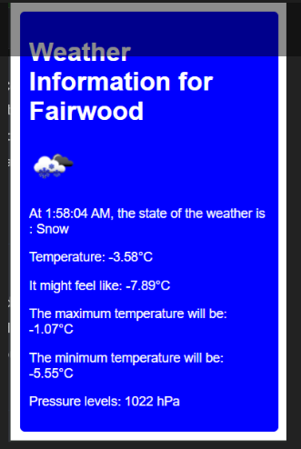

# Weather Extension README

## Introduction

**Weather Extension** is a Chrome extension designed to provide users with real-time weather updates based on their current location. It serves as an intuitive tool that integrates seamlessly into the user's browsing experience, offering quick access to the weather without needing to navigate away from the current page. This real-time data can be crucial for users to plan daily activities, ensure personal safety during severe weather conditions, and stay informed about the environment around them.

## Aim

The primary aim of the Weather Extension is to enhance the user experience by providing:

* Immediate access to weather information.
* Visual representation of current weather conditions.
* Local time synchronization to show weather data relevant to the user's time zone, thus enhancing accessibility to weather information.

## Features

* **Real-time Weather Updates** : Fetches weather data based on the user's geolocation.
* **Local Time Display** : Converts the time of the weather data calculation to the user's local time.
* **Temperature Readings** : Shows temperatures in both Celsius and Fahrenheit.

## Tools and Technologies

* **React.js** : A powerful JavaScript library (version X.XX) used to build the user interface.
* **OpenWeatherMap API** : Provides the real-time weather data used in the application.
* **Chrome Extensions API** : Facilitates the integration of the application as a Chrome browser extension.
* **CSS** : Enhances the application's look and feel with custom styles and themes.

## Installation and Setup

1. **Install Node.js** : Ensure Node.js is installed on your local device as it's required to run the project.
2. **Clone the Repository** : Clone the project to your local machine using the command:

<pre>

bash<button class="flex gap-1 items-center"><svg width="24" height="24" viewBox="0 0 24 24" fill="none" xmlns="http://www.w3.org/2000/svg" class="icon-sm"><path fill-rule="evenodd" clip-rule="evenodd" d="M12 4C10.8954 4 10 4.89543 10 6H14C14 4.89543 13.1046 4 12 4ZM8.53513 4C9.22675 2.8044 10.5194 2 12 2C13.4806 2 14.7733 2.8044 15.4649 4H17C18.6569 4 20 5.34315 20 7V19C20 20.6569 18.6569 22 17 22H7C5.34315 22 4 20.6569 4 19V7C4 5.34315 5.34315 4 7 4H8.53513ZM8 6H7C6.44772 6 6 6.44772 6 7V19C6 19.5523 6.44772 20 7 20H17C17.5523 20 18 19.5523 18 19V7C18 6.44772 17.5523 6 17 6H16C16 7.10457 15.1046 8 14 8H10C8.89543 8 8 7.10457 8 6Z" fill="currentColor"></path></svg>Copy code</button>

<code class="!whitespace-pre hljs language-bash">git clone https://github.com/Havcker243/cleanskys.git
   </code>

</pre>

1. **Install Dependencies** : Navigate to the project directory and install the necessary dependencies to ensure your app runs smoothly.

<pre>

bash<button class="flex gap-1 items-center"><svg width="24" height="24" viewBox="0 0 24 24" fill="none" xmlns="http://www.w3.org/2000/svg" class="icon-sm"><path fill-rule="evenodd" clip-rule="evenodd" d="M12 4C10.8954 4 10 4.89543 10 6H14C14 4.89543 13.1046 4 12 4ZM8.53513 4C9.22675 2.8044 10.5194 2 12 2C13.4806 2 14.7733 2.8044 15.4649 4H17C18.6569 4 20 5.34315 20 7V19C20 20.6569 18.6569 22 17 22H7C5.34315 22 4 20.6569 4 19V7C4 5.34315 5.34315 4 7 4H8.53513ZM8 6H7C6.44772 6 6 6.44772 6 7V19C6 19.5523 6.44772 20 7 20H17C17.5523 20 18 19.5523 18 19V7C18 6.44772 17.5523 6 17 6H16C16 7.10457 15.1046 8 14 8H10C8.89543 8 8 7.10457 8 6Z" fill="currentColor"></path></svg>Copy code</button>

<code class="!whitespace-pre hljs language-bash">cd weather-extension
   npm install
   </code>

</pre>

1. **Set Up the API Key** :

* Obtain an API key by registering on the [OpenWeatherMap website]().
* Create a `.env` file in the root directory of your project.
* Add your API key to the file: `REACT_APP_API_KEY=your_api_key_here`.
* After adding the `.env` file, restart your development server for the changes to take effect.

1. **Run the Application in Development Mode** :
   Run the app in development mode using:

<pre>

bash<button class="flex gap-1 items-center"><svg width="24" height="24" viewBox="0 0 24 24" fill="none" xmlns="http://www.w3.org/2000/svg" class="icon-sm"><path fill-rule="evenodd" clip-rule="evenodd" d="M12 4C10.8954 4 10 4.89543 10 6H14C14 4.89543 13.1046 4 12 4ZM8.53513 4C9.22675 2.8044 10.5194 2 12 2C13.4806 2 14.7733 2.8044 15.4649 4H17C18.6569 4 20 5.34315 20 7V19C20 20.6569 18.6569 22 17 22H7C5.34315 22 4 20.6569 4 19V7C4 5.34315 5.34315 4 7 4H8.53513ZM8 6H7C6.44772 6 6 6.44772 6 7V19C6 19.5523 6.44772 20 7 20H17C17.5523 20 18 19.5523 18 19V7C18 6.44772 17.5523 6 17 6H16C16 7.10457 15.1046 8 14 8H10C8.89543 8 8 7.10457 8 6Z" fill="currentColor"></path></svg>Copy code</button>

<code class="!whitespace-pre hljs language-bash">npm start
   </code>

</pre>

   Open [http://localhost:3000]() to view it in the browser.

1. **Build the Application for Production** :
   When you're ready to deploy the application, you need to build it for production:

<pre>

bash<button class="flex gap-1 items-center"><svg width="24" height="24" viewBox="0 0 24 24" fill="none" xmlns="http://www.w3.org/2000/svg" class="icon-sm"><path fill-rule="evenodd" clip-rule="evenodd" d="M12 4C10.8954 4 10 4.89543 10 6H14C14 4.89543 13.1046 4 12 4ZM8.53513 4C9.22675 2.8044 10.5194 2 12 2C13.4806 2 14.7733 2.8044 15.4649 4H17C18.6569 4 20 5.34315 20 7V19C20 20.6569 18.6569 22 17 22H7C5.34315 22 4 20.6569 4 19V7C4 5.34315 5.34315 4 7 4H8.53513ZM8 6H7C6.44772 6 6 6.44772 6 7V19C6 19.5523 6.44772 20 7 20H17C17.5523 20 18 19.5523 18 19V7C18 6.44772 17.5523 6 17 6H16C16 7.10457 15.1046 8 14 8H10C8.89543 8 8 7.10457 8 6Z" fill="currentColor"></path></svg>Copy code</button>

<code class="!whitespace-pre hljs language-bash">npm run build
   </code>

</pre>

   This command builds the app for production to the `build` folder.

1. **Load the Extension into Chrome** :

* Navigate to `chrome://extensions/` in the Chrome browser.
* Enable "Developer Mode".
* Click "Load unpacked" and select the `build` directory of your project.
* Check for any errors in the Chrome extensions page which might provide hints if the extension isn't loading as expected.

## Usage

Once installed, the Weather Extension icon will appear in your browser. Clicking the icon will open a popup displaying the current weather information, including temperature, condition, and local time. The background and icons will change according to the current weather conditions.

Here is a picture of how the extension would look when used 

## Code Overview

### Key Functions and Components

* **Weather Component (`Weather.js`)** : The heart of the application. It fetches weather data, processes user location, and renders the weather information.
* **API Calls** : Utilizes the OpenWeatherMap API to fetch real-time weather data based on latitude and longitude obtained from the user's geolocation.
* **State Management** : Uses React's `useState` for managing application state (e.g., weather data, local time) and `useEffect` for handling side effects (e.g., API calls, updating the UI in response to state changes).

### Understanding the Code

* **Fetching Weather Data** : The `fetchWeather` function dynamically constructs a URL with the user's coordinates and makes an API request to OpenWeatherMap. The resulting data is stored in the `weatherData` state.
* **Handling User Location** : The `getLocation` function checks if geolocation is available in the browser and, if so, fetches the user's current coordinates.
* **Dynamic Styling** : Based on the current weather conditions, the application dynamically updates its background and class styling to reflect the state of the weather visually.( This function is still been worked on currently )
* **Local Time Conversion** : Converts the provided UNIX timestamp from the weather data into a readable local time format, adjusting for the user's timezone.

## Challenges

* **Local Time Calculation** : Implementing a function to accurately convert UNIX timestamps to local time considering the user's timezone was challenging. The solution involved calculating the timezone offset and formatting the date accordingly.
* **Extension Deployment** : Understanding Chrome's extension requirements and ensuring the application adheres to these standards was a critical part of the deployment process.
* **Dynamic Styling** : Adding CSS and images that respond to the weather data to create an engaging and informative user interface presented its own set of challenges.
* **User-Friendly Enhancements** : Incorporating features like temperature unit conversion and making the application more versatile and accommodating was a focus of the development process.

## Future Enhancements

* Adding it to the chrome extension webstore
* **User Settings** : Future versions may include customizable settings like default temperature units or preferred locations.
* **Weather Forecast** : Later iterations might provide a 5-day or 10-day forecast.
* **Interactive UI** : Future updates could introduce interactive elements like animated weather icons or graphs showing temperature changes throughout the day.
* **Notifications** : Add notifications for severe weather alerts or significant weather changes.
* **Community Contributions** : We welcome contributions and feedback from the community to make the Weather Extension even better.

## Conclusion

The Weather Extension aims to provide a seamless and visually engaging way for users to stay informed about the weather. Its intuitive design and real-time data ensure users are always aware of their local weather conditions. As the project evolves, additional features and enhancements will be introduced to enrich the user experience further. Your feedback and contributions are welcome!
